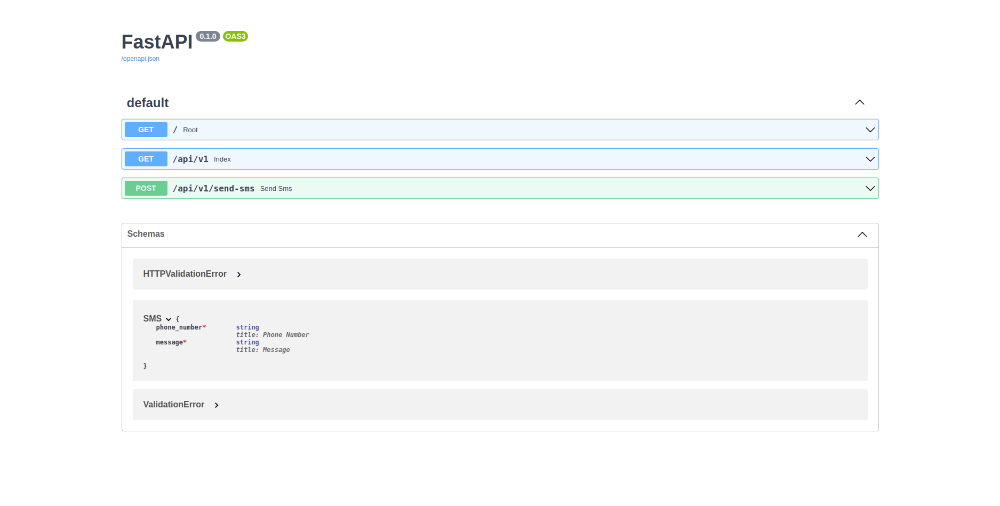

# Orange SMS Sender API

[](https://img.shields.io/badge/Python-3776AB?style=for-the-badge&logo=python&logoColor=white)

[](https://github.com/ellerbrock/open-source-badges/)


This is a simple and small `microservice` with the `ORANGE SMS API` fully integrated.

## Requirements

- `Python`

- `FastAPI`

## Setup

After pull or clone this repo you need to :

- Install required dependecies by running the following command : `pip install -r requirements.txt`

- Rename `.env.example` file to `.env` and fill parameters or variable defined in it

- Run the following command : `uvicorn main:app`

- Go to <http://localhost:8000>

### Important Notes

- You can visit <http://localhost:8000/docs> or <http://localhost:8000/docs> in order to visualize the `API Documentation`

- While filling `.env` parameters, just put your value for `DEV_PHONE_NUMBER` variable without `+` sign

## Usage

- The main endpoint that allow you to send sms is `/api/v1/send-sms` and need this payload :

```json
{
  "phone_number": "the recipient's number",
  "message": "your message here"
}
```

## TODO [WIP]

- Dockerize the service

### Screenshots



## Contributing

Feel free to make a PR or report an issue 😃

Oh, one more thing, please do not forget to put a description when you make your PR 🙂

## Author

- [M.B.C.M](https://github.com/PapiHack)
  [](https://twitter.com/the_it_dev)
